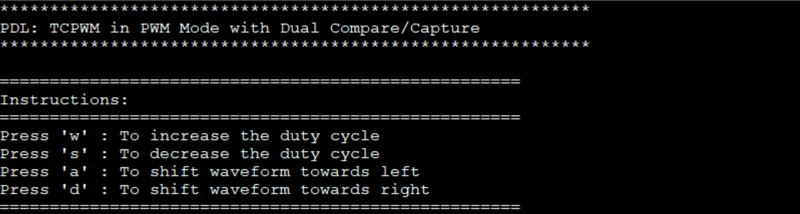
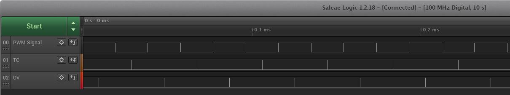
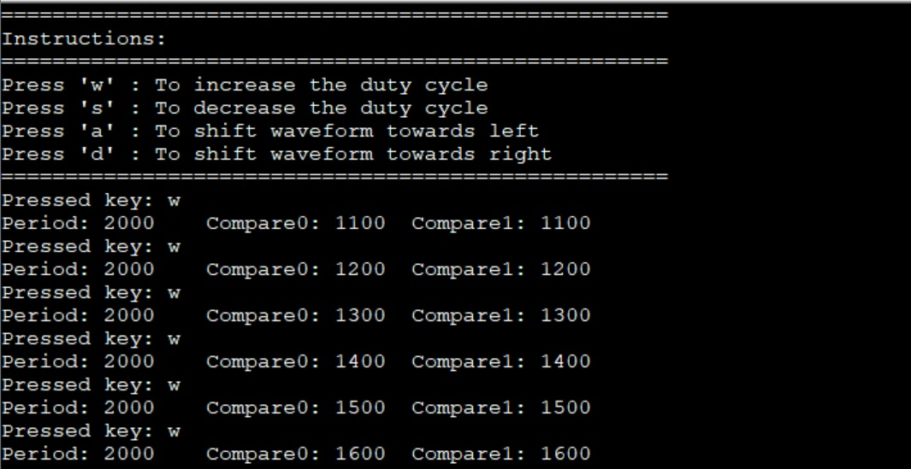
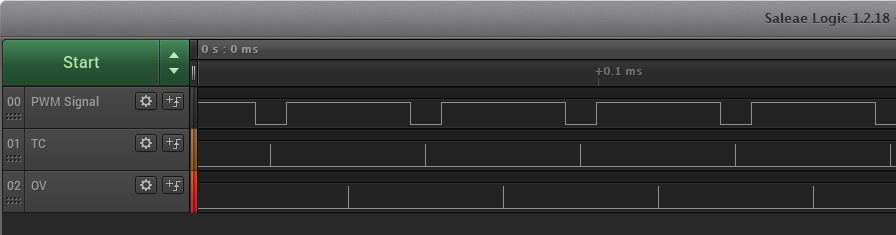
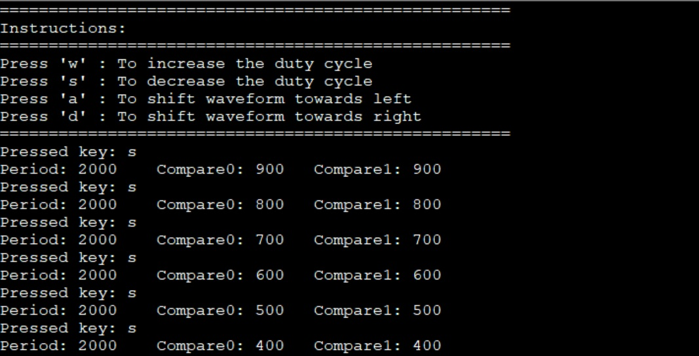
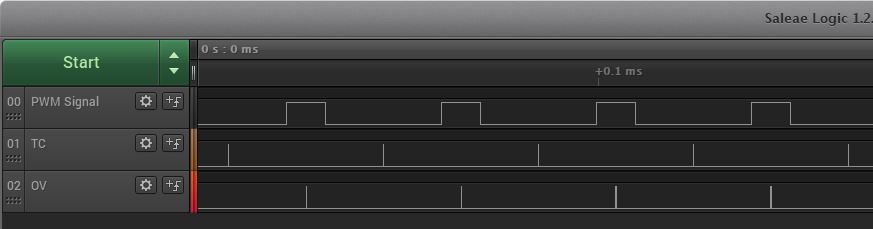
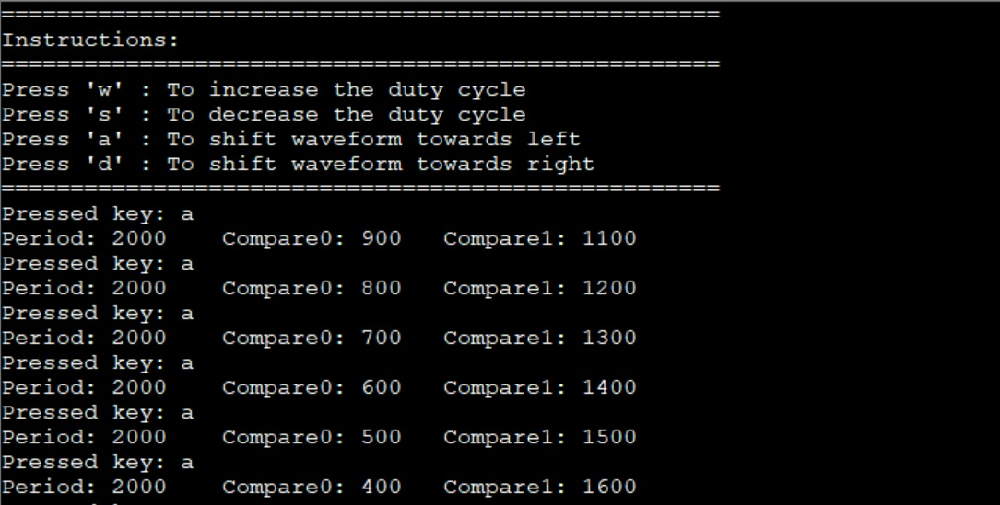
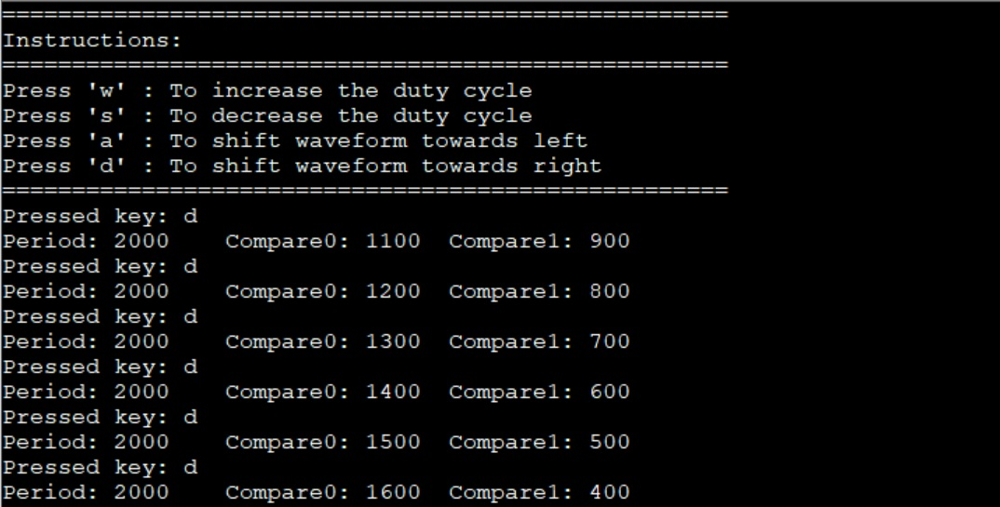
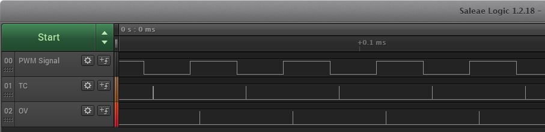
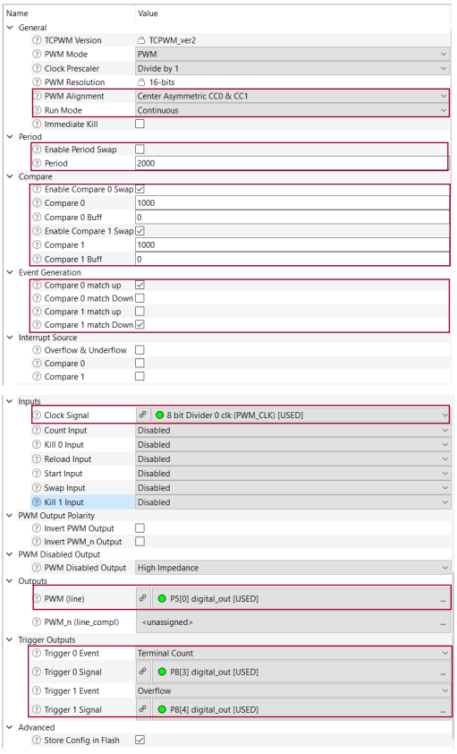

# PSOC&trade; Control MCU: TCPWM in PWM mode with dual compare/capture

This code example demonstrates the generation of asymmetric PWM signals using two compare/capture registers available in the TCPWM block of the supported MCU devices. Compared to the asymmetric PWM realized with only one compare function (where the CPU is used to update the compare value twice every PWM cycle), this solution uses two independent buffered compare values and causes less load on the CPU (where the CPU is used to update the compare value once every PWM cycle). This code example discusses these advantages and applications in field-oriented control (FOC).


[View this README on GitHub.](https://github.com/Infineon/mtb-example-ce240707-pwm-dual-compare-capture)

[Provide feedback on this code example.](https://cypress.co1.qualtrics.com/jfe/form/SV_1NTns53sK2yiljn?Q_EED=eyJVbmlxdWUgRG9jIElkIjoiQ0UyNDA3MDciLCJTcGVjIE51bWJlciI6IjAwMi00MDcwNyIsIkRvYyBUaXRsZSI6IlBTT0MmdHJhZGU7IENvbnRyb2wgTUNVOiBUQ1BXTSBpbiBQV00gbW9kZSB3aXRoIGR1YWwgY29tcGFyZS9jYXB0dXJlIiwicmlkIjoic29uYXMiLCJEb2MgdmVyc2lvbiI6IjEuMC4wIiwiRG9jIExhbmd1YWdlIjoiRW5nbGlzaCIsIkRvYyBEaXZpc2lvbiI6Ik1DRCIsIkRvYyBCVSI6IklDVyIsIkRvYyBGYW1pbHkiOiJQU09DIn0=)


## Requirements

- [ModusToolbox&trade;](https://www.infineon.com/modustoolbox) v3.3 or later
- Programming language: C
- Associated parts: PSOC&trade; Control C3

## Supported toolchains (make variable 'TOOLCHAIN')

- GNU Arm&reg; Embedded Compiler v11.3.1 (`GCC_ARM`) – Default value of `TOOLCHAIN`
- Arm&reg; Compiler v6.22 (`ARM`)
- IAR C/C++ Compiler v9.50.2 (`IAR`)


## Supported kits (make variable 'TARGET')

- [PSOC&trade; Control C3 Evaluation Kit](https://www.infineon.com/KIT_PSC3M5_EVK) (`KIT_PSC3M5_EVK`) 


## Hardware setup

This example uses the board's default configuration. See the kit user guide to ensure that the board is configured correctly.


## Software setup

See the [ModusToolbox&trade; tools package installation guide](https://www.infineon.com/ModusToolboxInstallguide) for information about installing and configuring the tools package.

Install a terminal emulator if you don't have one. Instructions in this document use [Tera Term](https://teratermproject.github.io/index-en.html).


## Using the code example

### Create the project

The ModusToolbox&trade; tools package provides the Project Creator as both a GUI tool and a command line tool.

<details><summary><b>Use Project Creator GUI</b></summary>

1. Open the Project Creator GUI tool.

   There are several ways to do this, including launching it from the dashboard or from inside the Eclipse IDE. For more details, see the [Project Creator user guide](https://www.infineon.com/ModusToolboxProjectCreator) (locally available at *{ModusToolbox&trade; install directory}/tools_{version}/project-creator/docs/project-creator.pdf*).

2. On the **Choose Board Support Package (BSP)** page, select a kit supported by this code example. See [Supported kits](#supported-kits-make-variable-target).

    > **Note:** To use this code example for a kit not listed here, you may need to update the source files. If the kit does not have the required resources, the application may not work.

3. On the **Select Application** page:

   a. Select the **Applications(s) Root Path** and the **Target IDE**.

    > **Note:** Depending on how you open the Project Creator tool, these fields may be pre-selected for you.

   b.	Select this code example from the list by enabling its check box.

    > **Note:** You can narrow the list of displayed examples by typing in the filter box.

   c. (Optional) Change the suggested **New Application Name** and **New BSP Name**.

   d. Click **Create** to complete the application creation process.

</details>

<details><summary><b>Use Project Creator CLI</b></summary>

The 'project-creator-cli' tool can be used to create applications from a CLI terminal or from within batch files or shell scripts. This tool is available in the *{ModusToolbox&trade; install directory}/tools_{version}/project-creator/* directory.

Use a CLI terminal to invoke the 'project-creator-cli' tool. On Windows, use the command-line 'modus-shell' program provided in the ModusToolbox&trade; installation instead of a standard Windows command-line application. This shell provides access to all ModusToolbox&trade; tools. You can access it by typing "modus-shell" in the search box in the Windows menu. In Linux and macOS, you can use any terminal application.

The following example clones the "[PSC3M5xD MCU: TCPWM in PWM mode with dual compare/capture](https://github.com/Infineon/mtb-example-ce240707-pwm-dual-compare-capture)" application with the desired name "PWMDualCompare" configured for the *KIT_PSC3M5_EVK* BSP into the specified working directory, *C:/mtb_projects*:

   ```
   project-creator-cli --board-id KIT_PSC3M5_EVK --app-id mtb-example-ce240707-pwm-dual-compare-capture --user-app-name PwmDualCompare --target-dir "C:/mtb_projects"
   ```


The 'project-creator-cli' tool has the following arguments:

Argument | Description | Required/optional
---------|-------------|-----------
`--board-id` | Defined in the <id> field of the [BSP](https://github.com/Infineon?q=bsp-manifest&type=&language=&sort=) manifest | Required
`--app-id`   | Defined in the <id> field of the [CE](https://github.com/Infineon?q=ce-manifest&type=&language=&sort=) manifest | Required
`--target-dir`| Specify the directory in which the application is to be created if you prefer not to use the default current working directory | Optional
`--user-app-name`| Specify the name of the application if you prefer to have a name other than the example's default name | Optional

<br>

> **Note:** The project-creator-cli tool uses the `git clone` and `make getlibs` commands to fetch the repository and import the required libraries. For details, see the "Project creator tools" section of the [ModusToolbox&trade; tools package user guide](https://www.infineon.com/ModusToolboxUserGuide) (locally available at {ModusToolbox&trade; install directory}/docs_{version}/mtb_user_guide.pdf).

</details>


### Open the project

After the project has been created, you can open it in your preferred development environment.


<details><summary><b>Eclipse IDE</b></summary>

If you opened the Project Creator tool from the included Eclipse IDE, the project will open in Eclipse automatically.

For more details, see the [Eclipse IDE for ModusToolbox&trade; user guide](https://www.infineon.com/MTBEclipseIDEUserGuide) (locally available at *{ModusToolbox&trade; install directory}/docs_{version}/mt_ide_user_guide.pdf*).

</details>


<details><summary><b>Visual Studio (VS) Code</b></summary>

Launch VS Code manually, and then open the generated *{project-name}.code-workspace* file located in the project directory.

For more details, see the [Visual Studio Code for ModusToolbox&trade; user guide](https://www.infineon.com/MTBVSCodeUserGuide) (locally available at *{ModusToolbox&trade; install directory}/docs_{version}/mt_vscode_user_guide.pdf*).

</details>


<details><summary><b>Keil µVision</b></summary>

Double-click the generated *{project-name}.cprj* file to launch the Keil µVision IDE.

For more details, see the [Keil µVision for ModusToolbox&trade; user guide](https://www.infineon.com/MTBuVisionUserGuide) (locally available at *{ModusToolbox&trade; install directory}/docs_{version}/mt_uvision_user_guide.pdf*).

</details>


<details><summary><b>IAR Embedded Workbench</b></summary>

Open IAR Embedded Workbench manually, and create a new project. Then select the generated *{project-name}.ipcf* file located in the project directory.

For more details, see the [IAR Embedded Workbench for ModusToolbox&trade; user guide](https://www.infineon.com/MTBIARUserGuide) (locally available at *{ModusToolbox&trade; install directory}/docs_{version}/mt_iar_user_guide.pdf*).

</details>


<details><summary><b>Command line</b></summary>

If you prefer to use the CLI, open the appropriate terminal, and navigate to the project directory. On Windows, use the command-line 'modus-shell' program; on Linux and macOS, you can use any terminal application. From there, you can run various `make` commands.

For more details, see the [ModusToolbox&trade; tools package user guide](https://www.infineon.com/ModusToolboxUserGuide) (locally available at *{ModusToolbox&trade; install directory}/docs_{version}/mtb_user_guide.pdf*).

</details>


## Operation

1. Connect the board to your PC using the provided USB cable through the KitProg3 USB connector.

2. Open a terminal program and select the KitProg3 COM port. Set the serial port parameters to 8N1 and 115200 baud.

3. Program the board using one of the following:

    <details><summary><b>Using Eclipse IDE</b></summary>

      1. Select the application project in the Project Explorer.

      2. In the **Quick Panel**, scroll down, and click **\<Application Name> Program (KitProg3_MiniProg4)**.
    </details>


   <details><summary><b>In other IDEs</b></summary>

   Follow the instructions in your preferred IDE.
    </details>


    <details><summary><b>Using CLI</b></summary>

     From the terminal, execute the `make program` command to build and program the application using the default toolchain to the default target. The default toolchain is specified in the application's Makefile but you can override this value manually:
      ```
      make program TOOLCHAIN=<toolchain>
      ```

      Example:
      ```
      make program TOOLCHAIN=GCC_ARM
      ```
    </details>

4. After programming, the application starts automatically. Confirm that "PDL: TCPWM in PWM Mode with Dual Compare/Capture" is displayed and instructions are printed on the terminal.

    **Figure 1. Terminal output and instructions**

    

5. Tap out the following pins to an oscilloscope:

   KIT-PSC3M5-EVK:
   1. P4_0 - PWM output (periodic square wave)
   2. P4_2 - Overflow (marks the center of the period)

6. On the oscilloscope, verify that a center-aligned square wave with a 50% duty cycle is generated on P4_0. Use the signal on P4_2 to verify the alignment.

    **Figure 2. Initial waveform**

    

7. Follow the instructions printed on the terminal to modify the waveform. Verify the output on the oscilloscope simultaneously.

    **Figure 3. Increase the duty cycle**

    

    

   <br>

    **Figure 4. Decrease the duty cycle**

    

    

   <br>

    **Figure 5. Shift the waveform left**

    

    

   <br>

    **Figure 6. Shift the waveform right**

    

    

## Debugging

You can debug the example to step through the code.


<details><summary><b>In Eclipse IDE</b></summary>

Use the **\<Application Name> Debug (KitProg3_MiniProg4)** configuration in the **Quick Panel**. For details, see the "Program and debug" section in the [Eclipse IDE for ModusToolbox&trade; user guide](https://www.infineon.com/MTBEclipseIDEUserGuide).

</details>


<details><summary><b>In other IDEs</b></summary>

Follow the instructions in your preferred IDE.
</details>


## Design and implementation

This code example demonstrates generating asymmetric PWM signals using dual compare/capture. The configuration required for the TCPWM block is done in a custom *design.modus* file.

An asymmetric PWM signal is a center-aligned PWM, which is shifted either to the left or right. In this mode, the counter counts up until its counter value reaches the period and then counts down until it becomes zero (repeats itself). The value in the CC0 register is used as a match when counting up and the value in the CC1 register is used as a match when counting down. When the counter value matches the CC0 register value, the PWM signal goes HIGH and when the counter value matches the CC1 register value, the PWM signal goes LOW. Therefore, by having different CC0 and CC1 register values, you can generate asymmetric PWM signals of any width and phase.

**Figure 7. TCPWM configurations in a custom design file**



The debug UART is used to accept commands from the terminal. A callback is generated upon every command received. The CC0_Buff and CC1_Buff register values are modified according to the command. A swap is then triggered to exchange CC and CC_Buff values.

The advantage of using dual compare/capture registers to generate asymmetric PWM signals is the reduction in CPU bandwidth usage. With only one CC register, the application must write new values to CC_Buff registers every half a cycle. With two CC registers, the application need to write new values to CC_Buff registers only once every cycle, thereby reducing the CPU bandwidth usage by half.

Asymmetric PWMs are widely used in field-oriented control (FOC) to drive gates of MOSFET bridges. The duty cycle of the PWM signals is modulated in the form of a sine wave to generate the required vectors. Asymmetric PWMs are used to introduce temporary phase shifts to measure the single-shunt current. The single-shunt design reduces the cost and complexity of the motor control application significantly.

### Resources and settings

**Table 1. Application resources**

 Resource  |  Alias/object     |    Purpose
 :-------- | :-------------    | :------------
 TCPWM (PDL)     | TCPWM0_GRP1_CNT0      | PWM block to generate asymmetric waveforms
 UART (HAL) | cy_retarget_io_uart_obj | UART HAL object used by retarget-io for debug UART port
 GPIO (PDL)      | pwm_output            | Brings out the PWM output signal
 GPIO (PDL)      | terminal_count        | Brings out the  terminal count signal (not applicable for `KIT-PSC3M5-EVK`)
 GPIO (PDL)      | overflow              | Brings out the overflow signal

<br>


## Related resources


Resources  | Links
-----------|----------------------------------
Application notes | 
Code examples  | [Using ModusToolbox&trade;](https://github.com/Infineon/Code-Examples-for-ModusToolbox-Software) on GitHub
Device documentation | 
Development kits | 
Libraries on GitHub  | [mtb-pdl-cat1](https://github.com/Infineon/mtb-pdl-cat1) – Peripheral Driver Library (PDL)  <br> [mtb-hal-cat1](https://github.com/Infineon/mtb-hal-cat1) – Hardware Abstraction Layer (HAL) library <br> [retarget-io](https://github.com/Infineon/retarget-io) – Utility library to retarget STDIO messages to a UART port
Middleware on GitHub  |[mcu-middleware](https://github.com/Infineon/modustoolbox-software) – Links to all MCU middleware
Tools  | [ModusToolbox&trade;](https://www.infineon.com/modustoolbox) – ModusToolbox&trade; software is a collection of easy-to-use libraries and tools enabling rapid development with Infineon MCUs for applications ranging from wireless and cloud-connected systems, edge AI/ML, embedded sense and control, to wired USB connectivity using PSOC&trade; Industrial/IoT MCUs, AIROC&trade; Wi-Fi and Bluetooth&reg; connectivity devices, XMC&trade; Industrial MCUs, and EZ-USB&trade;/EZ-PD&trade; wired connectivity controllers. ModusToolbox&trade; incorporates a comprehensive set of BSPs, HAL, libraries, configuration tools, and provides support for industry-standard IDEs to fast-track your embedded application development.

<br>


## Other resources

Infineon provides a wealth of data at [www.infineon.com](https://www.infineon.com) to help you select the right device, and quickly and effectively integrate it into your design.

For XMC&trade; MCU devices, see [32-bit XMC&trade; industrial microcontroller based on Arm&reg; Cortex&reg;-M](https://www.infineon.com/cms/en/product/microcontroller/32-bit-industrial-microcontroller-based-on-arm-cortex-m/).


## Document history

Document title: *CE240707* - *PSOC Control C3 MCU: TCPWM in PWM mode with dual compare/capture*

 Version | Description of change
 ------- | ---------------------
 1.0.0   | New code example for `KIT_PSC3M5_EVK`
 <br>
 

All other trademarks or registered trademarks referenced herein are the property of their respective owners.

The Bluetooth&reg; word mark and logos are registered trademarks owned by Bluetooth SIG, Inc., and any use of such marks by Infineon is under license.

© 2024 Infineon Technologies AG

All Rights Reserved.

### Legal disclaimer

The information given in this document shall in no event be regarded as a guarantee of conditions or characteristics. With respect to any examples or hints given herein, any typical values stated herein and/or any information regarding the application of the device, Infineon Technologies hereby disclaims any and all warranties and liabilities of any kind, including without limitation, warranties of non-infringement of intellectual property rights of any third party.

### Information

For further information on technology, delivery terms and conditions and prices, please contact the nearest Infineon Technologies Office (www.infineon.com).

### Warnings

Due to technical requirements, components may contain dangerous substances. For information on the types in question, please contact the nearest Infineon Technologies Office.

Infineon Technologies components may be used in life-support devices or systems only with the express written approval of Infineon Technologies, if a failure of such components can reasonably be expected to cause the failure of that life-support device or system or to affect the safety or effectiveness of that device or system. Life support devices or systems are intended to be implanted in the human body or to support and/or maintain and sustain and/or protect human life. If they fail, it is reasonable to assume that the health of the user or other persons may be endangered.

----------------------------------------------------------------------------